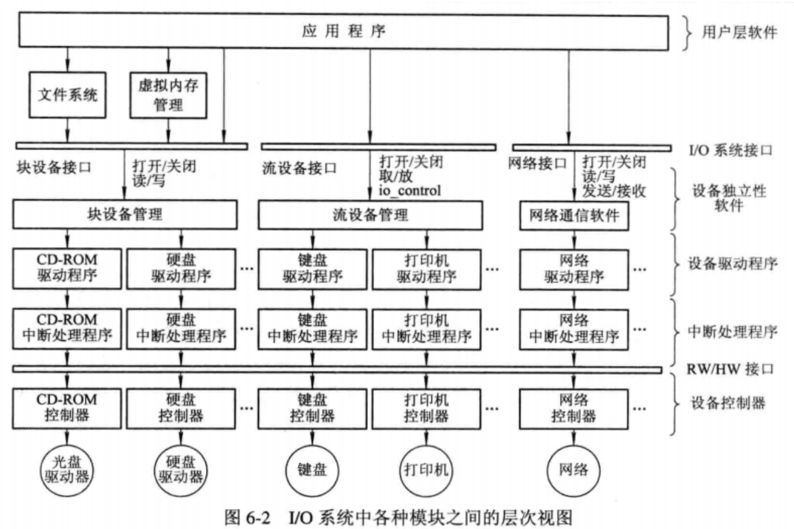

```
---
title: 操作系统
tags: 
- 我是0号标签关键词
- 我是1号标签关键词
- 我是2号标签关键词
categories:
---
```


## 简要介绍和常见问题

```
操作系统的主要功能：
处理器管理功能：
	进程控制：进程的创建、终止以及它们状态的转换
	进程同步：进程互斥、进程同步
	进程通信：消息队列
	调度：作业调度、进程调度
存储器管理功能
	内存分配
		主要任务：
			为每个进程分配内存空间、使它们各得其所
			提高利用率，减少内存碎片
			允许内存的动态变化
		方式：
			静态分配
			动态分配
	内存保护
		主要任务：
			用户进程互不干扰
			不允许用户进程访问os的进程和数据
	地址映射
		逻辑地址转化为物理地址
	内存扩充
		借助虚拟存储技术扩充内存
设备管理功能
	缓冲管理
		作用：
			缓和cpu和IO之间速度不匹配的矛盾
			减少中断时间的限制，提高cpu的利用率
			提高了cpu和io之间的并发能力
		缓冲机制：
			单缓冲机制
			双缓冲机制
			公用的多缓冲机制
	设备管理	
		根据用户的请求为其分配IO设备
	设备处理
		设备驱动程序，根据控制器发出的命令执行相应的中断
文件管理功能
	文件存储空间管理
	目录管理
	文件的读写管理和保护
操作系统和用户之间的接口
	用户接口
	程序接口

进程之间竞争资源面临的问题：
死锁、饥饿、互斥

单用户磁盘最佳调度策略？

程序的启动过程
1、创建进程，并分配私有的进程空间，将数据和代码映射到虚拟内存空间
2、加载器读入可执行文件中的导入符号表，根据导入符号表查找动态依赖库
3、针对每一个动态链接库调用loadlibrary
4、初始化全局变量
5、进入应用程序入口函数开始执行

进程和线程的区别：
	进程是程序的一个实例，是资源分配的基本单位
	线程是调度的基本单位。
	进程之间相互独立。多个线程共享进程的资源。
	进程的通信比线程复杂
	一个进程可以包含多个线程，一个线程从属于一个进程。
	安全性：进程有独立的空间，相对安全。线程共享内存，涉及到同步和数据一致性的问题。
	进程的切换开销比线程大

引入缓冲的原因：
	解决CPU和IO速度不匹配的问题
	减少中断频率，放宽对中断响应时间的限制
	提高cpu与IO之间的并行
	
为什么文件系统不采用红黑树？
因为数据量越大，树越深，IO次数越多，时间性能越差。

虚拟存储器：它是一种内存管理方式，旨在解决物理内存空间有限的问题，通过在内存和辅助内存之间数据对换来提供更大的内存空间。
实现原理：内存分页、地址转换、对换
通过虚拟内存可以实现内存保护、空间扩展、数据共享、延迟加载

	
缺页中断：
当寻找的这个数据不在内存的时候，os会向磁盘发送读盘命令，根据查找数据的位置读取一页或者连续的几个页装入内存，中断返回后继续执行程序。和普通中断的不一样在于缺页中断是在指令执行期间进行的。


SIGKILL信号 (-9)
定义: SIGKILL 是一种特定类型的信号，用于立即终止进程。
特性:
SIGKILL 强制终止进程，进程无法忽略或捕获这个信号，也无法进行任何清理操作。
这是一个“非优雅”的关闭方式，应当仅在其他关闭方式失败时使用。
为什么使用 SIGKILL
无法终止的进程: 当进程无响应或处于死锁状态时，常规信号（如 SIGTERM，信号编号为 15）可能无法终止进程。此时，SIGKILL 可以强制终止。
直接作用于内核: 由于 SIGKILL 直接由操作系统内核处理，不会传递给进程本身，因此无论进程处于何种状态，都能被终止。

硬链接（Hard Link）
定义: 硬链接是指向文件系统中的一个文件数据位置的直接指针。
特性:
创建硬链接相当于为同一文件内容创建了另一个名称和入口点。
硬链接和原始文件共享相同的inode（文件系统中的索引节点）。
删除原始文件后，通过硬链接仍然可以访问文件内容，因为数据实体仍存在，只有当所有链接都被删除后，文件数据才会被释放。
硬链接不能跨越文件系统（不能跨不同磁盘分区）。
硬链接不能链接到目录，只能链接到文件。
软链接（Symbolic Link，又称符号链接）
定义: 软链接类似于Windows系统中的快捷方式，它是一个特殊类型的文件，其中包含的是另一个文件或目录的路径引用。
特性:
软链接可以跨文件系统创建。
软链接可以链接到目录。
软链接包含的是目标文件或目录的路径。如果目标文件或目录被移动或删除，软链接将失效（称为“悬挂链接”或“死链接”）。
软链接相对于原始文件是独立的，有自己的inode和属性。
使用场景
硬链接：适用于需要确保即使原始文件名被删除，文件内容仍然保留的场景。
软链接：适用于需要链接到目录，或需要跨文件系统链接，或需要可见的指向另一个文件的引用的场景。


什么时候需要线程池？
控制并发的线程数量
任务队列
线程创建和销毁开销大
提高响应速度
```

## 进程的描述与控制

概念

```
前趋图：描述进程的执行顺序
PCB：进程控制块
```

进程的特征：

1. 动态性
2. 并发性
3. 独立性
4. 异步性

进程的状态：

[了解一下Linux进程的五种状态 - 知乎 (zhihu.com)](https://zhuanlan.zhihu.com/p/343806496#:~:text=Linux进程的状态 1 就绪状态和运行状态 就绪状态的状态标志state的值为TASK_RUNNING。 此时，程序已被挂入运行队列，处于准备运行状态。 一旦获得处理器使用权，即可进入运行状态。 ... 2,5 中止状态 状态标志state的值为TASK_DEAD。 ... 6 Linux的进程控制块 在Linux中，线程、进程使用的是相同的核心数据结构。 )

1. 创建
2. 就绪
3. 执行
4. 阻塞
5. 终止

还可以引入静止、激活操作

PCB的作用：

1. 作为独立运行基本单位。系统通过PCB感知进程的存在。
2. 能实现间断性运行方式。保存被中断前的现场信息。
3. 提供进程管理所需要的信息。访问内存、外存、文件、io设备。
4. 提供进程调度所需要的信息。进程状态、优先级。
5. 实现和其他进程的同步和通信。信号量等。

PCB的信息主要有：

1. 进程标识符
2. 处理机状态     通用寄存器、程序计数器、程序状态字、用户栈指针
3. 进程调度信息   进程状态、进程的优先级、进程等待时间和执行时间、进程的阻塞原因
4. 进程控制信息   进程的程序和数据的地址、同步和通信信息、资源清单、链接指针。

处理机的执行状态：

内核态  拥有较高的特权，可以访问所有指令、寄存器和存储区。

用户态	具有较低特权的执行状态，访问规定的指令、指定的寄存器和存储区。

os都包含了以下两大功能：

1. 支撑功能：中断处理、时钟管理、原语操作
2. 资源管理功能：进程管理、存储器管理、设备管理

同步机制遵循的规则：

1. 忙则等待
2. 空闲让进
3. 有限等待   避免死等
4. 让权等待  释放处理机

#### 硬件同步机制

1、关中断

缺点：

滥用关中断的权利可能会导致严重的后果。

关中断时间长会影响效率。

不适用于多cpu系统。

2、TS指令

3、利用Swap指令实现进程互斥

利用硬件实现互斥不符合让权等待

#### 信号量机制

1. 整型信号量   不符合让权等待的原则
2. 记录型信号量   符合让权等待，但是一个进程需要多个资源时容易死锁
3. AND型信号量   一次性分配所需资源
4. 信号量集   可一次性申请每类资源的多个

使用信号量机制时应该注意：signal和wait应该同时使用，缺少signal会使临界资源不被释放，也会使得因等待该资源阻塞的进程无法唤醒。

信号量的应用：

1. 互斥
2. 前趋关系

信号量的缺点：

大量的同步操作分布在各个进程，不仅给系统的管理带来麻烦，，还容易因同步操作的使用不当导致系统死锁。

管程机制：

定义：一个管程定义了一个数据结构和能为并发进程所执行的一组操作，这组操作能同步进程和改变管程中的数据。

条件变量是一种抽象的数据类型，每个条件变量保存了一个链表，用来记录因该条件阻塞的所有进程。

#### 进程通信

互斥和同步属于低级通信

进程通信的类型：

1. 共享存储系统
2. 管道通信系统    pipe文件
3. 消息传递系统 
4. 客户机服务器系统

#### 消息传递通信的实现方式

直接消息传递系统

​	发送进程利用os提供的发送原语直接将消息发送给目标进程。

信箱通信

实例：MQ

## 处理机调度与死锁

处理机调度算法的共同目标

1. 资源利用率
2. 公平性
3. 平衡性
4. 策略强制执行

分时系统的目标：

1. 响应时间快
2. 均衡性

#### 作业调度算法

FCFS

SJF  缺点：必须预先知道作业的运行时间、对长作业不利、无法人机交互、未考虑作业的紧迫程度

PSA

HRRN

#### 进程调度

任务

1. 保存处理器的现场信息
2. 按某种算法选取进程
3. 把处理器分配给进程

进程调度机制

1. 排队器    将就绪进程按照一定的策略插入到就绪队列
2. 分派器   将进程调度程序选出的进程从就绪队列中取出，分配处理机。
3. 上下文切换器   1、切换出当前进程的上下文    2、装入分派程序的上下文

上下文切换时，大量的load、store命令，每一次切换的时间可以执行上千条指令，为此靠硬件实现的方法减少上下文的切换时间。一般采用两组寄存器，一个用于系统态，一个用于用户态。

进程调度方式：

1. 抢占式
2. 非抢占式

#### 调度算法

轮转调度算法

​	原理：根据FCFS的策略，将就绪进程排成就绪队列，隔一段时间产生一次中断，激活进程调度程序，将CPU分给队首进程。

​	切换时机：进程完成、时间片用

优先级调度算法

多队列调度算法：每个就绪队列使用一种调度策略

多级反馈队列:1、设置多个就绪队列，每个队列的优先级不同。2、同一队列采用FCFS算法。3、按队列的优先级调度。

基于公平的调度算法

#### 死锁

造成死锁的原因：

1. 竞争不可抢占资源
2. 竞争可消耗资源
3. 进程推进顺序不当

产生死锁的必要条件：

1. 互斥
2. 请求和保持
3. 不可剥夺
4. 循环等待

处理死锁的方法：

1. 预防死锁   破坏死锁条件	请求保持（一次性分配-不好，使用完释放好）  不可抢占（不好实现） 循环等待（不好，编号，但是资源分配顺序不一定按照编号来）
2. 避免死锁   避免进入不安全的状态  银行家算法
3. 检测死锁  资源分配图    死锁的充分条件：当这个图时不可完全简化的
4. 解除死锁

## 存储器管理

#### 程序的装入

1. 绝对装入 	适合单道程序
2. 可重定位装入    不需要对换时
3. 动态运行装入(需要重定位寄存器支持)     适合有对换功能的os

#### 链接

静态链接 

​	需要相对地址变换 

​	外部调用符号变换

装入时动态链接   

​	便于修改和更新 

​	便于目标模块的共享

运行时动态链接  

​	对某些模块的链接推迟到运行时,如果程序执行的过程中发现有被调用模块未被调入内存,由os查找该模块,装入内存并链接到调用者模块.这样可以加快程序的装入过程还可以节省内存空间.


#### 内存的分配

单一连续分配 固定分区分配 动态分区分配 动态重定位分区分配

1、单一连续分配:单用户 单任务

2、固定分区分配:
	1分区大小相等 缺点是缺乏灵活性 程序太小时浪费内存 程序太大时不足以装下 但是对于同一台计算机控制多个相同对象时比较合适,比如炉温群控系统,同一台计算机控制多个相同的冶炼炉
	2分区大小不等 根据程序的大小进行适当的分区

3、动态分区分配
	涉及数据结构 分配算法 内存分配和回收操作
	数据结构:空闲分区表 空闲分区链
	空闲分区表 四个字段:分区号 大小 始址 是否空闲
	空闲分区链 双向链
	内存的分配和回收 

基于顺序的动态分区分配算法

1首次适应 低地址会留下很多内存碎片,同时也增加了查找分区的开销
2循环首次适应 减少了查找开销,但是缺乏大的空闲分区
3最佳适应	按照分区大小形成空闲分区链 但是还是有内碎片的问题
4最坏适应	查找效率高,内碎片问题少

基于索引的动态分区分配算法

1快速适应 为了有效归还分区 归还开销大 以空间换时间 
2伙伴系统
3哈希算法

动态可重定位的分区分配

和以上动态分区分配的区别仅在于多了紧凑功能

紧凑  小分区拼接为大分区

动态重定位   通过重定位寄存器实现

#### 对换

类型

1. 整体对换 其实就是中级调度
2. 页面对换	

磁盘空间分为

1. 文件区	离散分配，提高存储利用率
2. 对换区    连续分配，速度快

对换空间的空闲盘块管理的数据结构和内存的空闲分区的数据结构类似

对换空间的分配方式与内存的相似

#### 进程的换入换出

进程的换出

​	选择换出的进程：阻塞或睡眠状态的进程，同等情况下选择优先级低的。

​	进程换出过程：不能换出共享的程序段和数据段，需要先申请对换空间，回收内存，修改PCB和内存分配表。

进程的换入

#### 离散的分配方式

##### 分页存储管理

​	页面和物理块对应

​	大小通常是2的幂，1K-8K

​	地址结构：页号、位移量

​	页表：实现页面到物理块的映射，页表项需要有控制位规定该块的内容是存/取等权限。每个进程有一个页表。如果去写一个只读的块，会引起os的一次中断。实际上只存物理块号，页号为物理块号的索引。

​	PTR页表寄存器，记录着页表的始址。未执行时存放在PCB，执行到某进程时将其放入PTR。

​	当访问的页号大于或等于页表长度，出现地址越界中断。将对应的物理块号装入物理地址寄存器，将有效地址放入物理寄存器的块内地址字段，便完成了逻辑地址到物理地址的转换。

​	TLB快表，记录着页号和物理块的对应关系，页号是真实记录的。通常存放在联想寄存器中。

​	问题：32位操作系统下，页表的大小1M，还是连续的占用内存空间，解决方法有两种：

​	1、页表离散分配

​	2、需要的调入内存，不需要的放入磁盘。

​	可以将两种结合起来，用多级页表，再结合调页，外层页表项需要设置状态位。

##### 分段存储管理

引入原因：

​	方便编程  程序段、数据段、堆栈段

​	信息共享   是以信息的逻辑单位共享而非页为单位

​	信息保护   同样以信息的逻辑为单位

​	动态增长  

​	动态链接

分段：段号+段内地址

段表   与页表类似，设置段表寄存器

分页和分段的主要区别：

1. 分页的信息物理单位是页
2. 页面大小固定
3. 分页的用户程序空间是一维的

##### 段页式存储管理

 dui前边两个的结合

#### 虚拟存储器

常规存储器管理方式的特征：

1. 一次性
2. 驻留性

程序的局部性原理：

1. 大多数情况下是顺序执行的
2. 过程调用深度大多数情况下不会超过5
3. 程序存在许多循环结构
4. 程序还包含对许多数据结构的处理

定义：用户感知的存储空间比实际的物理空间大得多，但这只是错觉、虚的，人们称这种存储器为虚拟存储器。

特征：

1. 多次性
2. 对换性
3. 虚拟性

##### 虚拟存储器的实现方式

分页请求系统：

硬件支持：

1. 请求分页的页表机制
2. 缺页中断机构
3. 地址变换结构

软件：

请求调页的软件和实现页面置换的软件


请求分段系统

硬件支持：

1. 请求分段的段表机制
2. 缺段中断机构
3. 地址变换结构

软件：

请求调段的软件和实现段置换的软件

##### 请求分页的存储管理方式

请求页表机制： 页号 物理块号 状态位P 访问字段A 修改位M 外存地址

缺页中断机构：在指令执行期间产生和处理中断信号。一条指令可能产生多次缺页中断。

地址变换机构：

##### 请求分页的内存分配

为进程分配内存三个问题：

最小物理块数的确定

内存分配策略

分配的物理块数

##### 页面调入策略

何时调入页面：预调页策略、请求调页策略

从何处调入页面：

系统拥有足够的兑换空间，在进程运行前需要把文件拷贝到对换区。

系统缺少足够的兑换空间，不会被修改的从文件区调入，会被修改的拷贝到对换区。

缺页率：f=F/A   F是访问失败次数，A总访问次数。

##### 置换算法

1. 最佳置换算法
2. 先进先出置换算法
3. LRU算法  需要有寄存器或栈两者之一的硬件支持。
4. LFU算法
5. clock置换算法 NRU  
6. 页面缓冲算法   空闲页面列表、修改页面链表

##### 抖动与工作集

抖动原因：系统中的进程太多

工作集：某段时间间隔内，进程实际要访问的页面的集合。

抖动的预防方法：

1. 局部置换策略
2. 将工作集算法融入到处理机调度中 当内存页面不足时首先为缺页率高的进程增加物理块，此时不调入新的作业。
3. 利用L=S准则
4. 选择暂停的进程

##### 请求分段的存储管理方式

请求段表机制：段名 段长 段基址 存取方式 访问字段A 修改位M 存在位P 增补位 外存始址

缺段的中断机构

地址转换机构

##### 分段的共享与保护

共享段表：共享进程计数、存取控制字段、段号

分段保护：越界检查、存取控制检查、环保护机构

## IO系统

```
设备控制器也叫做适配器
```

#### IO设备系统的基本功能：

1. 隐藏物理设备的细节
   不同的IO设备的接收和发送数据的速度、粒度、数据的表示形式和方向各不相同，为了对千差万别的设备进行控制，因此需要设备控制器，这是一种硬件设备，它有少量的存储指令的寄存器和存储参数的寄存器，用户根据这些命令和参数控制外部设备完成所要求的操作。同时由于用户或者程序员难以编写直接编写这些设备的程序，所以IO设备需要对设备加以适当的抽象，以隐藏物理设备的实现细节，仅向上层进程提供少量的、抽象的读写命令。
2. 与设备的无关性
   不同的设备总有差别，即使同厂商的不同型号产品也有细微的差别，因此os将硬件设备同整个系统隔离开来，对硬件的操作和兼容性问题由驱动程序来解决，同时由操作系统为应用程序提供统一的操作方法。将外部设备看成文件，安装相应的驱动程序即可。
3. 提高处理机和IO设备的利用率
   IO设备需要尽可能和处理机并行工作，尽可能做到以下两方面：
   	1、处理机快速响应IO请求，让IO设备快速运行起来
   	2、减少IO设备运行期间处理机的干预时间
4. 对IO设备进行控制
   对IO设备进行控制是驱动程序的功能，目前对IO设备有四种控制方式：
   	 1、采用轮询的可编程IO方式
   	 2、采用中断的可编程IO方式
   	 3、直接存储器访问方式
   	 4、IO通道方式
5. 确保对设备的正确共享
   	1、独占设备
   	2、共享设备
6. 错误处理
   	底层软件可以解决就不向上层报告，不能解决就向上层报告。

#### IO软件的层次结构

1. 用户层IO软件	产生IO请求、格式化IO、spooling
2. 设备独立性软件	映射、保护、分块、缓冲、分配
3. 设备驱动程序	设置设备寄存器、检查状态
4. 中断处理程序
5. 硬件			执行IO操作

#### IO系统各模块之间的层次试图




#### 设备与控制器之间的接口

1. 数据信号线 	对输入设备而言，外界输入的信号经转换器转换后，所形成的数据通常先送入缓冲器中，当数据量达到一定比特后，再从缓冲区通过一组数据信号线传送给设备控制器。
2. 控制信号线     规定设备要执行的操作，如读操作、写操作、执行磁头移动等操作
3. 状态信号线     传送当前设备的状态，状态：在读、在写、已读、已写，并准备好新的数据传送、

#### 设备控制器的基本功能

1. 接收和识别命令	比如磁盘的read、write、format等15条命令
2. 数据交换       cpu与控制器、控制器和设备之间的数据交换
3. 标识和报告设备的状态    例如只有当设备处于发送就绪状态时，cpu才能启动控制器从设备中读取数据。
4. 地址识别       设备和寄存器都应该有自己的地址，因此控制器中应配置地址译码器。
5. 数据缓冲区    匹配IO设备和cpu之间的速度差异
6. 差错控制      进行差错检测，如果出现错误进行重新传送。

#### 设备控制器的组成

1. 设备控制器和处理机的接口	三类信号线
2. 设备控制器和设备的接口
3. IO逻辑

#### IO通道

作用：让cpu从繁忙的IO工作中解脱

通道类型：

1. 字节多路通道
2. 数组选择通道
3. 数组多路通道

#### 中断机构和中断处理程序

中断作用：进程的切换、cpu和IO设备的并行

中断是什么？中断是cpu对io设备发出中断信号的响应

陷入：内部中断

中断向量表、中断优先级

对多中断的处理方式：禁止中断和嵌套中断

中断程序的处理：

1. 测定是否有未响应的中断信号
2. 保护被中断进程的cpu环境
3. 转入相应的设备处理程序
4. 中断处理
5. 恢复cpu现场并退出中断

#### 设备驱动程序

功能：

1. 接收由设备无关的软件发来的命令和参数
2. 检查用户io请求的合法性
3. 发出io命令
4. 及时响应由设备设备控制器发送的中断请求

处理过程：

1. 将抽象要求转化成具体要求
2. 对服务请求进行校验
3. 检查设备的状态
4. 传送必要的参数
5. 启动io设备

DMA控制器的四类寄存器：

1. 命令/状态寄存器
2. 内存地址寄存器
3. 数据寄存器
4. 数据计数器

#### 与设备无关的软件

包含如下几项：

1. 设备驱动程序的统一接口	有利于开发 	映射	禁止用户直接找到访问设备以防止无权访问的用户使用
2. 缓冲管理
3. 差错控制	暂时性错误、持久性错误
4. 对独立设备的分配和回收
5. 独立于设备的逻辑数据块

独占设备的分配程序：

分配设备	根据设备名查找设备表，找到该设备的DCT

分配控制器

分配通道

#### 缓冲区管理

缓冲引入的原因：

1. 缓和cpu和io设备速度不匹配的问题
2. 减少对cpu的中断频率
3. 解决数据粒度不匹配的问题
4. 提高cpu和io设备之间的并行性

## 文件管理

#### 概念

```
文件系统的管理功能：将其管理的程序和数据组织成一系列文件的功能。
文件：是由创建者定义的、具有文件名的一组相关元素的集合。可分为有结构文件和无结构文件两种。文件在文件系统中是一个最大的数据单位。
记录：一组有意义的数据项的集合，用来描述一个对象在某方面的属性。
关键字：可以标识出一个记录的一个或多个数据项的集合。
数据项：基本数据项和组合的数据项。
文件的属性可以包含：文件类型、文件大小、文件的物理位置、文件的建立时间。
文件名：在不同系统中有不同的规定。
扩展名：方便用户了解。
```

#### 文件系统的层次结构

| 层次结构                   |                                        |
| -------------------------- | -------------------------------------- |
| 文件系统接口               | 命令接口、程序接口                     |
| 对对象操纵和管理的软件集合 | 文件系统管理的核心部分                 |
| 对象及其属性               | 管理的对象：文件、目录、磁盘的存储空间 |

##### 对对象操纵和管理的软件集合  

功能：

1. 对文件存储空间的管理
2. 对文件目录的管理
3. 将文件的逻辑地址转换为物理地址的机制
4. 对文件读和写的管理
5. 对文件共享和保护的管理

一般将与文件系统有关的软件分为四个层次：

1. IO控制层    设备驱动层。
2. 基本文件系统层  处理内存和磁盘之间的数据块交换。
3. 基本IO管理程序   将逻辑块号转化为物理块号、管理磁盘的空闲盘块、IO缓冲的指定。
4. 逻辑文件系统  用来处理与记录和文件相关的操作，如允许用户和应用程序使用符号文件名访问文件及记录，实现对文件和记录的保护等。

#### 文件操作

基本的文件操作

| 操作               | 描述                                                         |
| ------------------ | ------------------------------------------------------------ |
| 创建文件           | 先分配外存空间，然后添加目录项，写入文件属性                 |
| 删除文件           | 找到目录项，使之成为空项，然后回收所占用的存储的空间         |
| 读文件             | 根据用户名查找目录，得到被读文件在外存中的目录，得到在外存中的位置，还有对文件读写的指针 |
| 写文件             | 根据用户名查找目录，得到被写文件在外存中的目录，从中得到在外存中的位置，通过指针进行写操作 |
| 设置文件的读写位置 | 可以实现随机存取                                             |

文件的打开关闭操作：

为了多次重复检索目录，引入open的系统调用，当第一次请求对文件操作时，通过open系统调用打开文件，打开是指将文件从外存拷贝到内存的一个表目录中，并将表目录的编号返回给用户。关闭是将表目录删除此表项。

其他文件操作：

对文件的操作、对目录的操作。

#### 文件的逻辑结构

逻辑结构：用户所观察到的文件组织形式

物理结构：在外存的组织形式

文件逻辑结构的基本要求：

1. 提高文件的检索速度
2. 方便对文件进行修改
3. 减少文件占用的存储空间

按是否有结构可分为：

1. 有结构文件    又分为：定长记录、变长记录
2. 无结构文件	以字节为单位

按文件组织形式可分为：

1. 顺序文件   按照某种顺序排列，既可是定长的也可是变长的
2. 索引文件   建立一张索引表，每一个记录设置一个表项
3. 索引顺序文件   前两种的结合，为一组记录中的第一个记录建立一个索引表

##### 顺序文件（最基本、最常见的）

1. 串结构	按时间顺序存入，检索很麻烦
2. 顺序结构

优点：批量存取

缺点：

1. 查找或修改单个记录性能差
2. 增加和删除一个记录比较困难  解决方法：增加一个运行记录文件或事务文件

##### 记录寻址

为访问顺序文件的一条记录，首先找到该记录的地址。查找记录地址的方式有两种：

隐式寻址方式   顺序访问

​		定长记录的话很容易确定下一个记录的逻辑地址，每次只需要加记录长度

​		变长记录  只能顺序访问比较慢

显式寻址方式  随机访问

​	通过文件中记录的位置

​	利用关键字

##### 索引文件

按照关键字建立索引

​		建立一张索引表，每个表项记录指向记录的指针以及记录的长度。实现直接存取。索引按照关键字排序。查找时可以采取折半查找。

具有多个索引表的索引文件

​		可以方便用户使用不同的字段进行索引

##### 索引顺序文件

用于变长的顺序文件，同时又减少了建立表的开销。

索引文件表中一个表项是一组记录的第一个记录的关键字。

两级索引文件：更是空间换时间

##### 直接文件和哈希文件

直接文件：关键字的值决定了记录的物理位置

哈希文件：利用哈希函数将关键字转化为相应的物理地址。

#### 文件目录

对文件目录的要求：

1. 实现按名存取
2. 提高对目录的检索速度
3. 文件共享
4. 允许文件重名

##### 文件控制块和索引节点

FCB描述和控制文件的数据结构，包含

基本信息

​		文件名、文件物理位置、文件逻辑结构、文件的物理结构

存取信息    存取权限

使用信息 	时间、使用等。

##### 索引节点

引入：

当文件很多时，文件目录可能占用大量的盘块。查找目录时必须先将目录文件的第一个盘块的调入内存，然后进行比较。未找到继续调入内存进行查找。所以将文件名和描述信息分开。文件描述信息单独成为数据结构，目录项由文件名和i节点构成。

磁盘索引节点：

包含以下内容：

1. 文件主标识符
2. 文件类型
3. 文件存取权限
4. 文件物理地址
5. 文件长度
6. 文件连接计数
7. 文件存取时间

当被打开时（即调入内存）后增加：

1. 索引节点编号
2. 状态
3. 访问计数
4. 逻辑设备号
5. 链接指针

##### 简单的文件目录

单级目录

两级目录	为用户单独建立一个用户文件目录 缺点是不便共享文件

##### 树形目录

明显提高目录的检索速度和文件系统的性能。主目录被称为根目录

路径名和当前目录的概念

目录操作：

创建、删除、改变、移动、链接、查找

目录查询技术：

​	线性检索

​	hash方法

#### 文件共享

基于DAG实现文件共享   缺点是新增加的内容不会被共享

利用索引节点	文件的物理信息和属性放入到索引节点而非目录项中

利用符号链接实现共享	其实就是软链接   缺点：增加了空间和开销

##### 文件保护

访问权：系统控制进程对对象的访问。对象可以是软件也可以是硬件、操作可以是读写、执行等。

保护域：域是进程对一组对象访问权的集合。

进程和域之间的联系：动态、静态

访问矩阵：s

基本的访问矩阵：域和对象组成的二维矩阵，矩阵中的值是能操作的权限。

具有域切换的访问矩阵：进程可以从一个域切换到另一个域。

访问矩阵的修改：

1. 拷贝权
2. 所有权
3. 控制权

访问矩阵的实现：

1. 访问控制表
2. 访问权限表

## 磁盘存储器管理

#### 外存的组织方式

连续组织方式

​	为每一个文件分配相邻的物理块，此时的物理文件也被称作顺序文件。

​	优点：顺序访问容易、顺序访问块。

​	缺点：要求为一个文件分配连续的存储空间、事先知道文件的长度、不能灵活插入和删除记录、对动态文件难以预判。

链接组织形式  又分为

隐式链接	随机访问的效率低

显式链接	使用文件分配表FAT

##### FAT技术

FAT12 	分为早期的、以簇为单位的

FAT16

FAT 32

#### NFFS的文件组织形式

NTFS新特征：

1. 64位磁盘地址
2. 很好地支持长文件名
3. 具有系统容错功能
4. 保证数据的一致性
5. 文件加密、文件压缩

磁盘组织：

以簇为单位进行磁盘空间的分配和回收

LCN和VCN的定义

文件的组织：

主控文件表MFT,每行是文件控制字

索引组织方式

单级索引	为每个文件分配一个索引块

多级索引组织方式

增量索引

#### 文件存储空间的管理

磁盘分配表

空闲表法和空闲链表法

位视图法

成组链接法

##### 提高磁盘IO的途径

1. 改进目录结构以及减少检索目录的方法
2. 选取好的文件存储结构
3. 提高磁盘的IO速度

磁盘高速缓存

设计时需要考虑的问题？

1. 如何将高速缓存中的数据传送给请求进程       数据交付、指针交付
2. 采用什么样的置换策略
3. 已修改的盘块何时写回磁盘

提高IO速度的其他办法：

1. 提前读
2. 延迟写
3. 优化物理块分布
4. 虚拟盘

RAID

1. 0级	并行交叉存取
2. 1级	磁盘镜像
3. 3级	奇偶校验
4. 5级	无专门的校验盘，校验信息分布在各个盘
5. 6级和7级	性能好价格贵

提高磁盘可靠性的技术

1. 第一级容错技术SFT-I
2. 第二级容错技术SFT-II

基于集群技术的容错功能

1. 双机热备份技术
2. 双机互为备份模式
3. 公用磁盘模式

后备系统  磁带机、硬盘、光盘驱动器

##### 数据一致性控制

这里的数据一致性是指 保存在多个文件中的同一个数据，在任何情况下都能保证相同。

##### 事务

事务的定义：ACID

事务记录

为了实现上述的源自修改，通常借助于事务记录的数据结构实现。这些数据结构被放在一个非常可靠的存储器，用来记录事务运行时数据项修改的全部信息，故又称为运行记录，包含以下字段：事务名、数据项名、旧值、新值

事务记录表中的每一记录描述了事务运行中的重要事务操作，如修改操作、开始事务、托付事务或夭折事务。在一个事务Ti开始执行时，<Ti开始>记录被写入事务记录表中，在TI执行期间，在TI的任何写操作之前，必须写一适当的新纪录到事务记录表中，当<TI>进行托付时，再把一个<TI托付>记录写入到事务记录表中。

恢复算法：

undo<Ti> 该过程把所有被事务Ti修改过的数据恢复到修改前的值。

redo<Ti> 该过程能把所有被事务Ti修改过的数据设置为新值。

如果系统发生故障，系统对以前发生的事务进行清理。通过查找事务记录表，将完成的事务通过redo<TI>设置为新值，把未完成的事务通过undo<TI>设置为旧值。

检查点

新的恢复算法

##### 并发控制

利用互斥锁是心啊顺序性

利用共享锁和互斥锁实现顺序性

##### 重复数据的一致性问题

重复文件的一致性

链接数一致性检查

## 操作系统接口

#### 用户接口	

**1、字符显示式联机用户接口（联机命令接口）**

​	命令行方式

​	批命令方式

类型：

1. 系统访问类
2. 文件操作命令
3. 目录操作命令
4. 其他命令

**2、图形化联机用户接口**

**3、脱机用户接口**

#### 系统调用的实现

控制是由原来的用户态转化为系统态，这是借助陷入机制来完成的。该机制包含了陷入硬件机构及陷入程序两部分。

## 多处理机操作系统

多处理机系统的引入：

1、cpu时钟频率问题

​	缩小元器件的体积越来越小

​	散热问题越南解决

2、增加系统的吞吐量

3、节省投资

4、提高系统可靠性

多处理机系统的类型：

1、紧密耦合MPS和松散耦合MPS

2、对称多处理机系统和非对称多处理机系统

#### 多处理机系统的结构

UMA多处理机系统

​	基于单总线的SMP结构


‘’‘’‘’‘

#### 网络操作系统

IPV4协议需要解决的三个问题：

1. 寻址
2. 分段和重新组装
3. 源路由选择

ipv6协议：

地址扩充、安全机制等

传输层协议：TCP、UDP

##### 网络操作系统及其分类

网络操作系统及其特征：

1. 硬件独立性
2. 接口一致性
3. 资源透明性
4. 系统可靠性
5. 执行并行性

分类：

1. 对等模式
2. 工作站/服务器模式
3. 客户/服务器模式
4. 浏览器/服务器模式

功能：

1. 数据通信
2. 应用互操作
3. 网络管理

